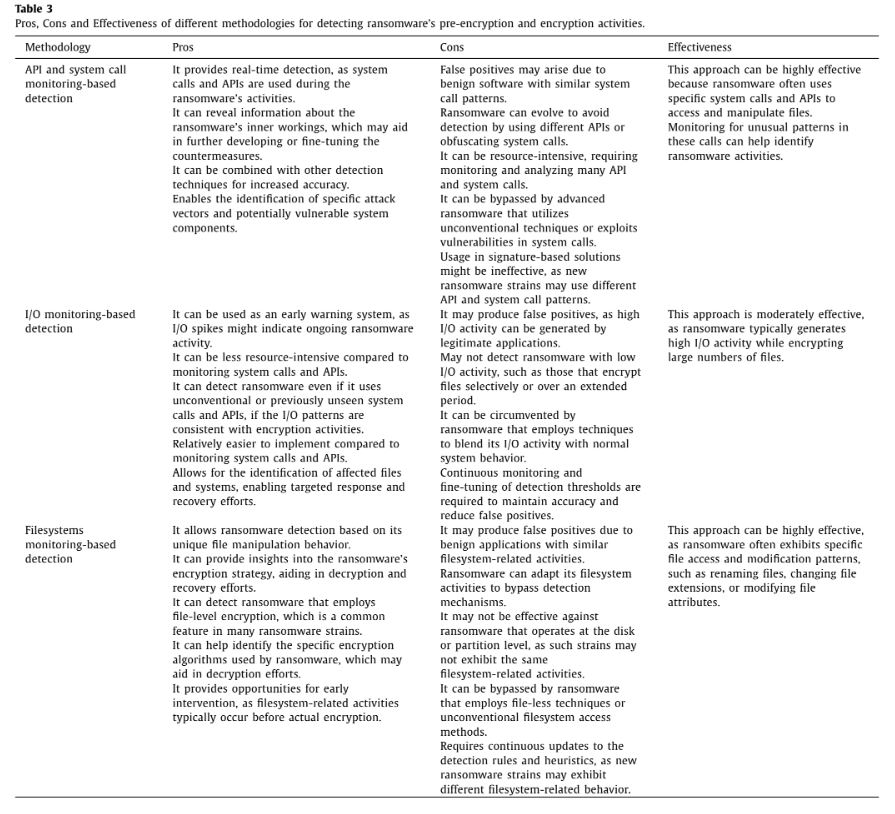

# Bibliographic notes.

## Surveys

There is some interesting references in the survey [(Cen, 2023)](https://drive.google.com/file/d/1gDN4WYrqDrvKwQ9MQQxUuXCnOZvOMlZf/view?usp=drive_link) regarding early detection solutions for Android in refs. 63-74. A brief explanation about kinds of detection and ransomware is also included in this ref.

In [K. Begovic, 2023](https://drive.google.com/file/d/1dasBBxs1z0l7t0a2kdBiZEFqBvSFk7QR/view?usp=drive_link) make a interesting and more tecnical review of the several types of ransomware and detection, mostly from the criptograhic point of view. They sepparate different aproaches in three categories:
- API and system call monitoring-based detection. They mention several aproaches of this kind and give a list of windows API related to this. Keep an eye also in OpenSSL. These API are the following ones:


- I/O monitoring. They monitor memory access and filesystem usage as well as network flow. Check some references to find out more specifically. Entropy analisys of files infilesystem (?).



## Network data.
I still have to decide wether to use a different tool per each OS or to use psutils for all of them. Look for what kind of info uses other realted works.

According to ref [(Schoenbachler, 2023)](https://drive.google.com/file/d/1UnIbWdUNv8WK9_bSsCPjqGDaKZr2R7Pf/view?usp=drive_link/), it's a good idea to look for the number of different hosts connectec, UDP connections made and DNS connections. I assume that the relevant fact is the number.

Other interesting ref is [(M.Akibis et al., 2024)](https://drive.google.com/file/d/1S2iyGnuRVN_Zegtd7Xwtdl9fVOtuDjvF/view?usp=drive_link):

```
Ransomware tends to generate unusually high volumes of small, frequent packets, particularly during its lateral spread phase, creating  discernible patterns that can be captured through traffic monitoring systems [19, 20]. Additionally, communication frequency tends to escalate as ransomware attempts to connect with external command-and-control servers, which creates a distinguishable deviation from typical network behavior [21].

```
## Events on Windows
[This entry](https://blogs.jpcert.or.jp/en/2024/09/windows.html) from JPCERT (Computer Secutiry Incident Respone of Japan) has an interesting compilation of Window's events as indicator of compromise of several families of ransomware. 


## HW activity and performance.
In [(Alam, 2018)](https://drive.google.com/file/d/1Sv0PCjQSWHR4QB3pADWbKkMS6PUE3gQm/view?usp=drive_link), they develop a RAPPER (Ransomware Prevention via Performance Counter), and they use HPCs for this performance evaluation. Maybe is a good idea to use them along with psutils library.


## Registry events, API calls and filesystem activity (OS related activity)
In [(Ganfure, 2020)](https://drive.google.com/file/d/1VRWqS83AVqN8JwuVcMT-_DXu-_utwsCY/view?usp=drive_link) they develop a detector using the filesystem activity: 
```
we propose a simple but effective concept of user-file interaction modeling with deep generative autoencoder architecture. Unlike other works aiming to look at ransomware signature or dynamic behavior, this work aimed to capture a legitimate user’s behavior by logging the recurrence of user-file interaction such as create, delete, changed, and rename operations every t seconds.
```

# To do.

## Surveys
- [x] [Ransomware early detection: A survey. Mingcan Cen, Frank Jiang, Xingsheng Qin, Qinghong Jiang, Robin Doss. 2023](https://drive.google.com/file/d/1gDN4WYrqDrvKwQ9MQQxUuXCnOZvOMlZf/view?usp=drive_link)
- [x] [K. Begovic, A. Al-Ali, Q. Malluhi, Cryptographic ransomware encryption detection: Survey, Comput. Secur. 132 (2023)](https://drive.google.com/file/d/1dasBBxs1z0l7t0a2kdBiZEFqBvSFk7QR/view?usp=drive_link)    
- [x] [S. Razaulla, C. Fachkha, C. Markarian, A. Gawanmeh, W. Mansoor, B.C.M. Fung, C. Assi, The age of ransomware: A survey on the evolution, taxonomy, and research directions, IEEE Access 11 (2023) 40698–40723](https://drive.google.com/file/d/1HNFoCorE563P4CcsnqMZx0n1NpIbhsqH/view?usp=drive_link)
- [x] [N. A. Malik et al., "Behavior and Characteristics of Ransomware - A Survey," 2024 ](https://drive.google.com/file/d/1cM_TlbnNcM9yIeVNsBWD0KAm7DPTpPFm/view?usp=drive_link)
- [x] [Dynamic Behavioural Analysis of Privacy-Breaching and Data Theft Ransomware. Mehmet Ozturk. PREPRINT!](https://drive.google.com/file/d/1RcHAlOiV-h8YnfBl5_GJiaPiqsOJgDy4/view?usp=drive_link)

## HW activity and performance bibl.
- [x] [RAPPER: Ransomware Prevention via Performance Counters. Manaar Alam et al. 2018](https://drive.google.com/file/d/1Sv0PCjQSWHR4QB3pADWbKkMS6PUE3gQm/view?usp=drive_link)

## Network activity.
- [x] [Sorting Ransomware from Malware Utilizing Machine Learning Methods with Dynamic Analysis. Schoenbachler et al. 2023](https://drive.google.com/file/d/1UnIbWdUNv8WK9_bSsCPjqGDaKZr2R7Pf/view?usp=drive_link/)

- [x] [Measuring Ransomware Propagation Patterns via Network Traffic Analysis: An Automated Approach. M.Akibis et al. 2024 PREPRINT](https://drive.google.com/file/d/1S2iyGnuRVN_Zegtd7Xwtdl9fVOtuDjvF/view?usp=drive_link)

## Registry events, API calls and filesystem activity (OS related activity) bibl.
- [x] [DeepGuard: Deep Generative User-behavior Analytics for Ransomware Detection. Ganfure. 2020](https://drive.google.com/file/d/1VRWqS83AVqN8JwuVcMT-_DXu-_utwsCY/view?usp=drive_link)